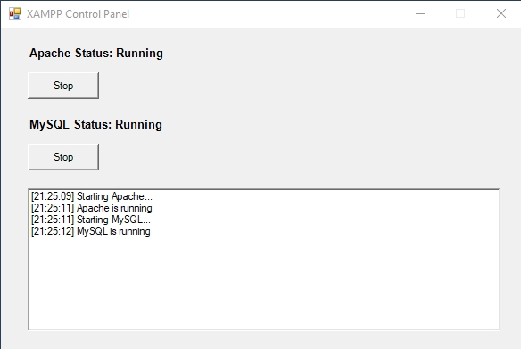

# XAMPP Setup

*Installation Script*

Since [XAMPP](https://www.apachefriends.org/) isn’t actively developed anymore, I went ahead and created this package to help you install and manage Apache, PHP (with XDebug) and MySQL on Windows using PowerShell. 

## Getting Started 

 
2. **Clone or Download** this repository to your machine.
 
4. **Open PowerShell as administrator**  (important to ensure everything installs smoothly).
 
6. **Run**  `.\xampp-setup.ps1` to install Apache, PHP, MySQL.

  - The script will handle the downloading and configuring of these components for you.
 
8. **Follow any on-screen prompts** and let the script do its magic.

## Controlling Services 

Once the setup is complete, you can **start or stop**  Apache and MySQL at any time using the `xampp-control.ps1` script:

```powershell
.\xampp-control.ps1
```

### Screenshot 



## License 

This project is licensed under the [MIT License](https://opensource.org/license/mit).